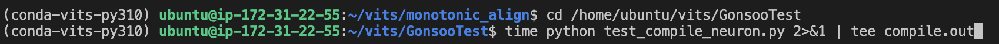
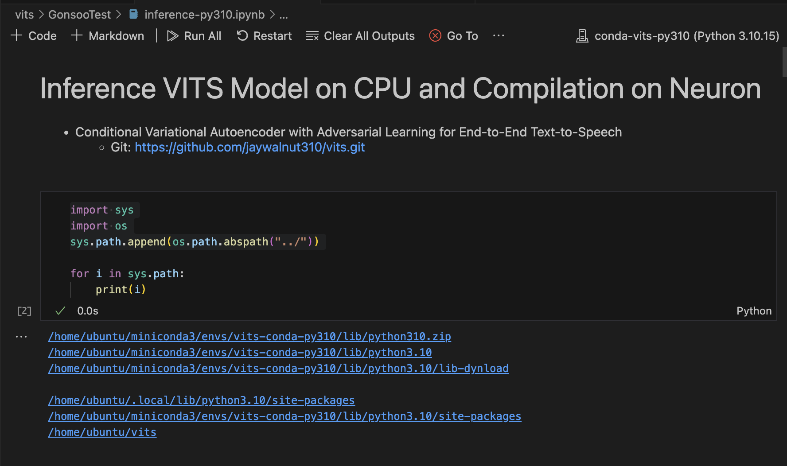

# INF1-TTS Model-Compilation-Issue:
# Summary
- The customer wants to use a TTS model called ["Conditional Variational Autoencoder with Adversarial Learning for End-to-End Text-to-Speech"](https://github.com/jaywalnut310/vits.git) on Inferentia.
After completing a neuron environment setup, I successfully loaded the model onto the CPU and performed inference. However, the Neuron compilation encountered several errors. Please refer to the "Exact compile log result" below. Is it possible to provide guidance on resolving these errors?
To reproduce this error, please follow the steps as below.
---


# A. Setup Environment

## 1. Launch Inf1.8xlarge
- Install Guide
    - [Get Started with Neuron on Ubuntu 22 with Neuron Multi-Framework DLAMI](https://awsdocs-neuron.readthedocs-hosted.com/en/latest/general/setup/neuron-setup/multiframework/multi-framework-ubuntu22-neuron-dlami.html#setup-ubuntu22-multi-framework-dlami)
- instance: inf1.8xlarge
- AMI ID
    - Deep Learning AMI Neuron (Ubuntu 22.04) 20240921, 
    - ami-0980ce83654efe544
- When having an error for capacity, increase "Running On-Demand Inf instances" on EC2: [Requesting a quota increase](https://docs.aws.amazon.com/servicequotas/latest/userguide/request-quota-increase.html)


## 2. Downlaod Git
Clone the folloiwng git
```
git clone https://github.com/gonsoomoon-ml/lab.git
```
## 3. Create conda virtual environment
- install conda
    ```
    wget https://repo.anaconda.com/miniconda/Miniconda3-latest-Linux-x86_64.sh -O ~/miniconda.sh
    bash ~/miniconda.sh -b -p ~/miniconda3
    rm ~/miniconda.sh
    ~/miniconda3/bin/conda init bash
    source ~/.bashrc
    conda --version
    ```
- create conda virtual environment
    ```
    conda create -n conda-vits-py310 python=3.10
    source activate conda-vits-py310
    ```
- install neuron dependency
    ```
    pip install neuron-cc==1.24.* torch-neuron==1.13.1.2.11.7.0
    pip install tensorflow==1.15.5.post1
    ```
- install requirements.txt
    ```
    cd /home/ubuntu/vits/GonsooTest
    pip install -r requirements.txt 
    ```
- install other dependency
    ```
    sudo apt-get install espeak
    cd /home/ubuntu/vits/monotonic_align
    python setup.py build_ext --inplace
    ```
- install jupyter kernel
    ```
    # Install Jupyter notebook kernel
    pip install ipykernel 
    python -m ipykernel install --user --name conda-vits-py310  --display-name "conda-vits-py310"

    # For reference:
    # jupyter kernelspec list
    # jupyter kernelspec uninstall VITS
    ``` 
- Verify the dependency
    ``` 
    pip list | grep -E "neuron|setuptools|Cython|librosa|matplotlib|numba|numpy|phonemizer|scipy|torch|Unidecode|tensorflow"
    ``` 
- It is okay if you have the follwoing information:
    ``` 
    Cython                       3.0.11
    librosa                      0.9.2
    matplotlib                   3.6.3
    matplotlib-inline            0.1.7
    neuron-cc                    1.24.0.0+d58fa6134
    numba                        0.55.2
    numpy                        1.22.2
    phonemizer                   2.2.1
    scipy                        1.10.1
    setuptools                   69.5.1
    tensorflow                   1.15.5.post1
    tensorflow-estimator         1.15.1
    torch                        1.13.1
    torch-neuron                 1.13.1.2.11.7.0
    Unidecode                    1.1.1
    ``` 


# B. Test Compilation
## 0. Obtain vits model weight file
- Clone original git and copy models/pretrained_ljs.pth" into the same folder in this git, and copy models/pretrained_ljs.pth" to 01-inferentia-stt-vits/vits/models
    - ["Conditional Variational Autoencoder with Adversarial Learning for End-to-End Text-to-Speech"](https://github.com/jaywalnut310/vits.git) 
## 1. Test neuron compilation through python file
- Make sure that you are in the conda virtual environment, (conda-vits-py310)
    - 
    ```
    cd /home/ubuntu/vits/GonsooTest
    time python test_compile_neuron.py 2>&1 | tee compile.out
    ``` 
- Errors:  "Exact compile log result" --> [Full execution log file](compile.out)
    ``` 
    INFO:Neuron:There are 61 ops of 7 different types in the TorchScript that are not compiled by neuron-cc: prim::CallFunction, aten::randn_like, aten::index_put_, aten::gather, aten::index, aten::randn, aten::embedding, (For more information see https://awsdocs-neuron.readthedocs-hosted.com/en/latest/release-notes/compiler/neuron-cc/neuron-cc-ops/neuron-cc-ops-pytorch.html)
    [INFO] There are 61 ops of 7 different types in the TorchScript that are not compiled by neuron-cc: prim::CallFunction, aten::randn_like, aten::index_put_, aten::gather, aten::index, aten::randn, aten::embedding, (For more information see https://awsdocs-neuron.readthedocs-hosted.com/en/latest/release-notes/compiler/neuron-cc/neuron-cc-ops/neuron-cc-ops-pytorch.html)
    INFO:Neuron:Number of arithmetic operators (pre-compilation) before = 2009, fused = 1958, percent fused = 97.46%
    [INFO] Number of arithmetic operators (pre-compilation) before = 2009, fused = 1958, percent fused = 97.46%
    [WARNING] From /home/ubuntu/miniconda3/envs/conda-vits-py310/lib/python3.10/site-packages/torch_neuron/ops/aten.py:2412: where (from tensorflow.python.ops.array_ops) is deprecated and will be removed in a future version.
    Instructions for updating:
    ...
    [ERROR] neuron-cc failed with the following command line call:
    /home/ubuntu/miniconda3/envs/conda-vits-py310/bin/neuron-cc compile /tmp/tmpuz2ixr7t/graph_def.pb --framework TENSORFLOW --pipeline compile SaveTemps --output /tmp/tmpuz2ixr7t/graph_def.neff --io-config '{"inputs": {"0:0": [[1, 33, 192], "float32"], "1:0": [[1], "int64"]}, "outputs": ["TextEncoder_8/aten_to/Cast:0", "TextEncoder_8/aten_split/split:0", "TextEncoder_8/aten_split/split:1", "StochasticDurationPredictor_10/aten_mul/mul:0", "StochasticDurationPredictor_10/aten_detach_1/Const:0", "StochasticDurationPredictor_10/aten_detach_2/Const:0"]}' --verbose 35
    Traceback (most recent call last):
    File "/home/ubuntu/miniconda3/envs/conda-vits-py310/lib/python3.10/site-packages/torch_neuron/convert.py", line 413, in op_converter
        neuron_function = self.subgraph_compiler(
    File "/home/ubuntu/miniconda3/envs/conda-vits-py310/lib/python3.10/site-packages/torch_neuron/decorators.py", line 263, in trace
        raise subprocess.SubprocessError(
    subprocess.SubprocessError: neuron-cc failed with the following command line call:
    /home/ubuntu/miniconda3/envs/conda-vits-py310/bin/neuron-cc compile /tmp/tmpuz2ixr7t/graph_def.pb --framework TENSORFLOW --pipeline compile SaveTemps --output /tmp/tmpuz2ixr7t/graph_def.neff --io-config '{"inputs": {"0:0": [[1, 33, 192], "float32"], "1:0": [[1], "int64"]}, "outputs": ["TextEncoder_8/aten_to/Cast:0", "TextEncoder_8/aten_split/split:0", "TextEncoder_8/aten_split/split:1", "StochasticDurationPredictor_10/aten_mul/mul:0", "StochasticDurationPredictor_10/aten_detach_1/Const:0", "StochasticDurationPredictor_10/aten_detach_2/Const:0"]}' --verbose 35
    WARNING:Neuron:torch.neuron.trace failed on _NeuronGraph$1026; falling back to native python function call
    [WARNING] torch.neuron.trace failed on _NeuronGraph$1026; falling back to native python function call
    ERROR:Neuron:list index out of range
    Traceback (most recent call last):
    File "/home/ubuntu/miniconda3/envs/conda-vits-py310/lib/python3.10/site-packages/torch_neuron/convert.py", line 413, in op_converter
        neuron_function = self.subgraph_compiler(
    File "/home/ubuntu/miniconda3/envs/conda-vits-py310/lib/python3.10/site-packages/torch_neuron/decorators.py", line 77, in trace
        passes.pass_remove_mutation(jit_trace)
    File "/home/ubuntu/miniconda3/envs/conda-vits-py310/lib/python3.10/site-packages/torch_neuron/passes/remove_mutation.py", line 780, in pass_remove_mutation
        storage, mutated = view_update_backward(graph, node, replacement)
    File "/home/ubuntu/miniconda3/envs/conda-vits-py310/lib/python3.10/site-packages/torch_neuron/passes/remove_mutation.py", line 688, in view_update_backward
        original, updated, insertions = handler(graph, node, updated)
    File "/home/ubuntu/miniconda3/envs/conda-vits-py310/lib/python3.10/site-packages/torch_neuron/passes/remove_mutation.py", line 297, in undo_select
        left = create_slice(graph, tensor, dim, zero, index, one)
    File "/home/ubuntu/miniconda3/envs/conda-vits-py310/lib/python3.10/site-packages/torch_neuron/passes/remove_mutation.py", line 162, in create_slice
        tensor_size = size[dim_value]

    ``` 
## 2. Test neuron compilation through notebook. 
- You can inference VITS TTS model on CPU as a test 
    - Opne /home/ubuntu/vits/GonsooTest/inference-py310.ipynb
    - Select kernel, conda-vits-py310 like this
        - 
