# 가이드: How to set up EFA on AWS EC2 P4d

아래의 참고 자료를 일부 내용을 참고 하였습니다. 아래 내용 보면서, 부족한 부분은 아래 참고 내용을 보시기 바랍니다.
- 참고 자료
    - [Amazon EC2에서 HPC 워크로드를 위한 EFA 및 MPI 시작하기](https://docs.aws.amazon.com/ko_kr/AWSEC2/latest/UserGuide/efa-start.html#efa-start-tempinstance)

    

## 1. EFA를 사용한 보안 그룹 준비
먼저 "보안 그룹" 을 생성 합니다. 이는 EC2 를 생성할때 사용합니다.
아래와 같이 인바운드/아웃바운드 세팅을 해주세요.
- inbound
    - 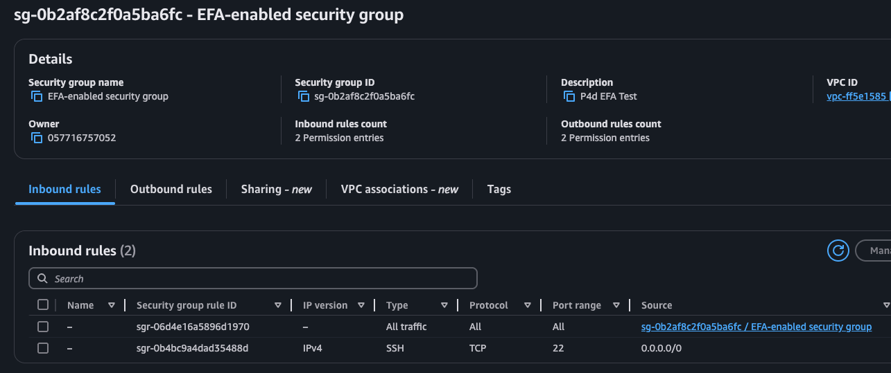
- outbound
    - 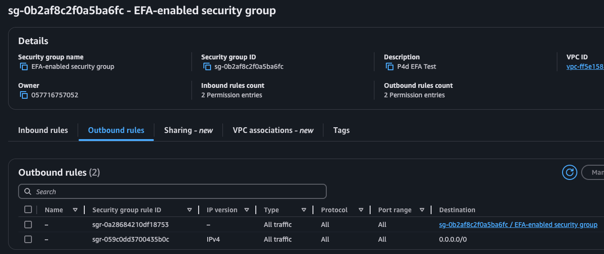

## 2. 인스턴스 생성

* AMI Image & Instance Type
아래 주어진 AMI 및 Instancy Type 을 참조 하세요. 본인은 Capacity Reservation 을 통해서 인스턴스를 선택 하였습니다.
    * 
* VPC Subnet
    - 인스턴스 생성시 할당된 VPC 의 Available Zone (AZ) 에 Subnet 을 지정해야 합니다. (예: us-east-1c)
    * 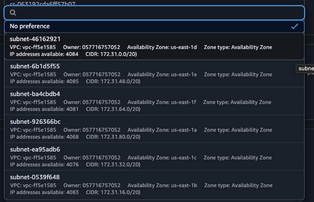
* [중요] 네트워크 카드 설정 - 고급
    * 카드1: 아래와 같이 설정을 해주어야 합니다. 
        * 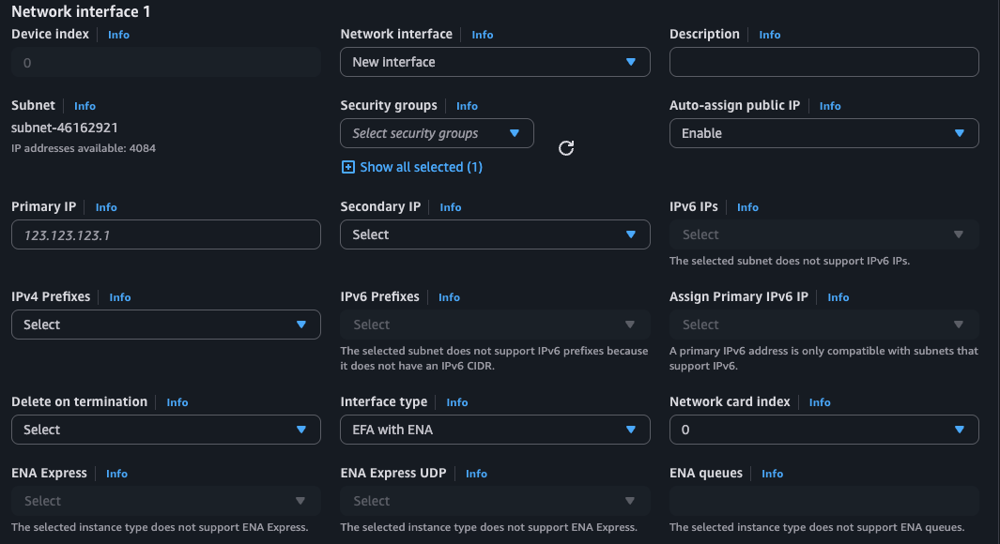
    - 최대 EFA 4개의 카드를 추가할 수 있습니다. 이 가이드는 1개만을 대상으로 합니다.
        - [참고] 현재 저자는 4개의 EFA 카드를 추가를 시도 했으나, 정확한 방법을 모르겠습니다. 추후 개선 해보겠습니다.
* 스토리지
    - 스토리지는 충분하게 생성해주세요. 
    * 256 GB 설정
* 두 개 인스턴스 준비 완료
    * 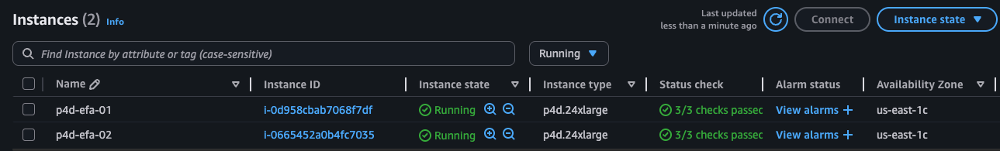

## 3. EFA 설치 여부 확인
현재의 사용한 AMI 는 기본적인 Nvidia GPU 드라이버 & CUDA & EFA 라이브러리 가 미리 설치 되어 있습니다. 
* Nvidia GPU 드라이버가 작동하는지 확인
    ```
    nvidia-smi -q | head
    ```
    * 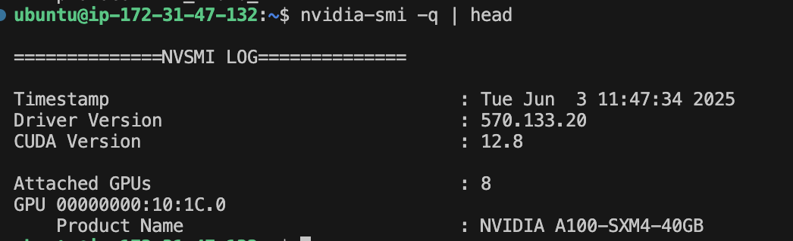
* EFA 소프트웨어 구성 요소가 성공적으로 설치되었는지 확인
    ```
    fi_info -p efa -t FI_EP_RDM
    ```
        * 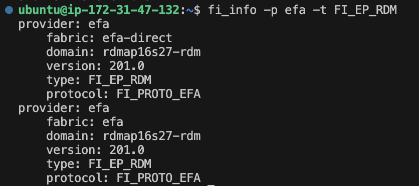
    

## 4. EFA 동작 테스트:
EFA 동작 테스트는 "NCCL 테스트" 를 설치해서 진행 합니다.

* NCCL Git Repo 다운로드
    ```
    git clone https://github.com/NVIDIA/nccl-tests.git && cd nccl-tests
    ```
* Libfabric 디렉터리를 LD_LIBRARY_PATH 변수에 추가
    ```
    export LD_LIBRARY_PATH=/opt/amazon/efa/lib:$LD_LIBRARY_PATH # Ubuntu
    ```
* NCCL 테스트 설치
아래 명령이 에러가 경로가 잘못 되어 있으면, 수정해서 사용하세요.
    ```
    make MPI=1 MPI_HOME=/opt/amazon/openmpi \
            NCCL_HOME=/usr/local/cuda-12.6 \
            CUDA_HOME=/usr/local/cuda-12.6
    ```
    - 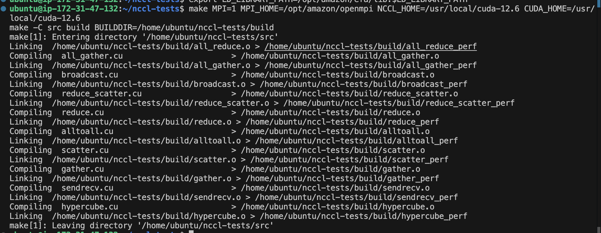
    
* Host 파일 생성
    ```
    /opt/amazon/openmpi/bin/mpirun \
            -x FI_EFA_USE_DEVICE_RDMA=1 \
            -x LD_LIBRARY_PATH=/opt/nccl/build/lib:/usr/local/cuda/lib64:/opt/amazon/efa/lib:/opt/amazon/openmpi/lib:/opt/amazon/ofi-nccl/lib:$LD_LIBRARY_PATH \
            -x NCCL_DEBUG=INFO \
            --hostfile my-hosts -n 8 -N 8 \
            --mca pml ^cm --mca btl tcp,self --mca btl_tcp_if_exclude lo,docker0 --bind-to none \
            $HOME/nccl-tests/build/all_reduce_perf -b 8 -e 1G -f 2 -g 1 -c 1 -n 100
    ```
* EFA 및 NCCL 구성 테스트
    * 위의 my-hosts 파일이 있는 위치에서 실행 함.
        ```
            /opt/amazon/openmpi/bin/mpirun \
            -x FI_EFA_USE_DEVICE_RDMA=1 \
            -x LD_LIBRARY_PATH=/opt/nccl/build/lib:/usr/local/cuda/lib64:/opt/amazon/efa/lib:/opt/amazon/openmpi/lib:/opt/amazon/ofi-nccl/lib:$LD_LIBRARY_PATH \
            -x NCCL_DEBUG=INFO \
            --hostfile my-hosts -n 8 -N 8 \
            --mca pml ^cm --mca btl tcp,self --mca btl_tcp_if_exclude lo,docker0 --bind-to none \
            $HOME/nccl-tests/build/all_reduce_perf -b 8 -e 1G -f 2 -g 1 -c 1 -n 100
        ```

    * 결과
        ```
        ip-172-31-47-132:11752:11839 [6] NCCL INFO NET/OFI Running on p4d.24xlarge platform, Setting NCCL_TOPO_FILE environment variable to /opt/amazon/ofi-nccl/share/aws-ofi-nccl/xml/p4d-24xl-topo.xml
        ip-172-31-47-132:11749:11843 [3] NCCL INFO NET/OFI Selected provider is efa, fabric is efa (found 1 nics)
        ```

        - 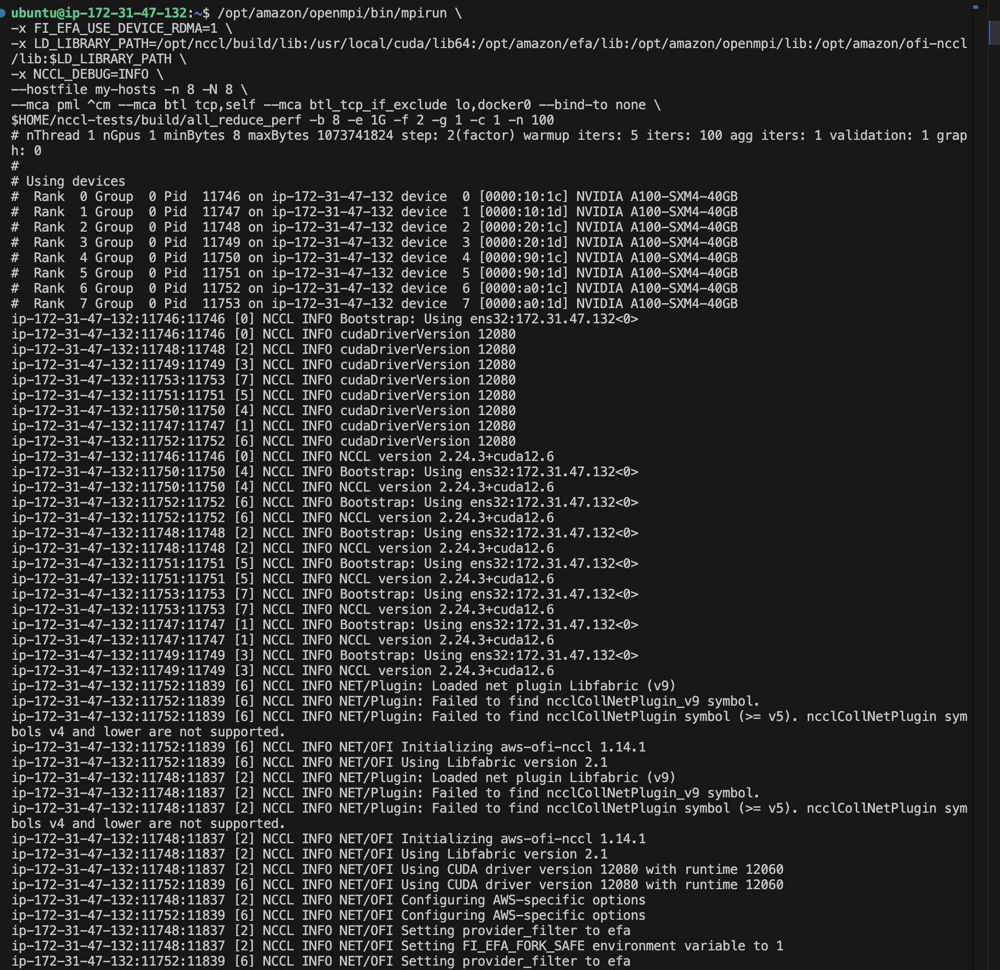
            ```
            * 위의 실행 로그 요약
                * 훌륭한 결과입니다! NCCL 테스트가 성공적으로 완료되었네요. 주요 결과를 분석해보겠습니다:
                * 🎉 테스트 성공!
                * 시스템 구성
                * 인스턴스: AWS p4d.24xlarge
                * GPU: 8x NVIDIA A100-SXM4-40GB
                * NCCL: 버전 2.24.3+cuda12.6
                * 네트워킹: EFA (Elastic Fabric Adapter) with aws-ofi-nccl 1.14.1
                * 성능 결과
                * 평균 버스 대역폭: 54.16 GB/s
                * 1GB 데이터 처리:
                    * 알고리즘 대역폭: ~130 GB/s
                    * 버스 대역폭: ~227 GB/s
                    * 처리 시간: ~8.25ms
                * 지연시간 (8바이트): ~79-82 마이크로초
                * 오류: 0개 ✅
                * 네트워크 토폴로지
                * 모든 GPU 간 P2P 연결 활성화
                * EFA 네트워크를 통한 고성능 통신
                * 24개 collective 채널, 32개 P2P 채널
                * 주요 특징
                * ✅ 8개 GPU 모두 정상 인식
                    ✅ P2P (Peer-to-Peer) 통신 활성화
                    ✅ EFA 네트워킹 최적화
                    ✅ 모든 크기의 데이터에서 안정적 성능
                    ✅ 오류 없이 완료
                * 이 결과는 분산 학습을 위한 최적의 설정을 보여줍니다. 이제 PyTorch나 다른 ML 프레임워크에서 멀티-GPU 훈련을 효율적으로 실행할 수 있습니다!
            ```

## 5. Run code

* 아래 Git Repo 를 다운로드 하세요.
    ```
    git clone https://github.com/pytorch/examples.git
    ```
- 사용 코드
    - https://github.com/pytorch/examples/blob/main/distributed/ddp-tutorial-series/multigpu_torchrun.py
        - 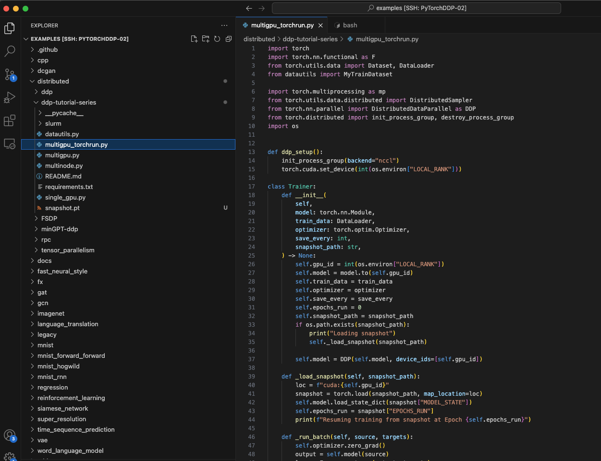
* 가상 환경인 pytorch 로 진입 합니다. 
    * 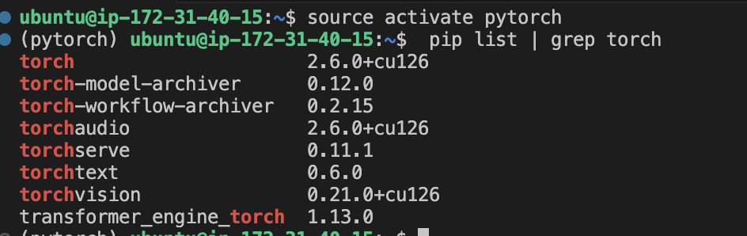
* 첫번째 EC2 에서 다음의 멸령어를 실행하세요. 
    * rdzv_endpoint=172.31.47.132:30000  is the first EC’s private ip.
    * —node_rank=0 is only different
        ```
                cd /home/ubuntu/examples/distributed/ddp-tutorial-series
                
                torchrun --nproc_per_node=8 \
                --nnodes=2 \
                --node_rank=0 \
                --rdzv_id=456 \
                --rdzv_backend=c10d \
                --rdzv_endpoint=172.31.47.132:30000 multigpu_torchrun.py 3000 1000
        ```

* 첫번째 EC2 에서 다음의 멸령어를 실행하세요. : (
    * rdzv_endpoint=172.31.47.132:30000  is the first EC’s private ip.
    * —node_rank=1 is only different
            ```
            cd /home/ubuntu/examples/distributed/ddp-tutorial-series

            torchrun --nproc_per_node=8 \
            --nnodes=2 \
            --node_rank=1 \
            --rdzv_id=456 \
            --rdzv_backend=c10d \
            --rdzv_endpoint=172.31.47.132:30000 multigpu_torchrun.py 3000 1000
            ```
            
## 6. Monitoring EFA on two EC2
* 모니터링 shell 파일
    ```
        * #!/bin/bash
            
            # EFA 확인
            if ! fi_info -p efa >/dev/null 2>&1; then
                echo "❌ EFA가 설정되어 있지 않습니다."
                exit 1
            fi
            
            # 인터페이스 찾기
            EFA_IFACE=$(ls /sys/class/net/ | grep -E "(ens|eth)" | head -1)
            echo "모니터링 시작: $EFA_IFACE (Ctrl+C로 종료)"
            
            # 실시간 모니터링
            watch -n 1 "echo 'EFA Stats ($EFA_IFACE) - \$(date +\"%H:%M:%S\")'; cat /proc/net/dev | grep $EFA_IFACE | awk '{printf \"📥 수신: %.1f MB\\n📤 송신: %.1f MB\", \$2/1024/1024, \$10/1024/1024}'"
            
    ```
* EFA 모니터링 결과
    * 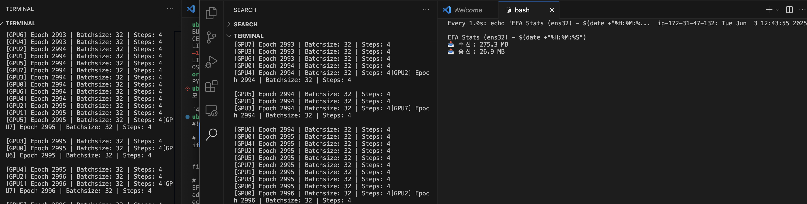
* GPU 사용율
    * all GPUs on each machine are being used.
    * The first machine:
        * watch -n 1 nvidia-smi
        * 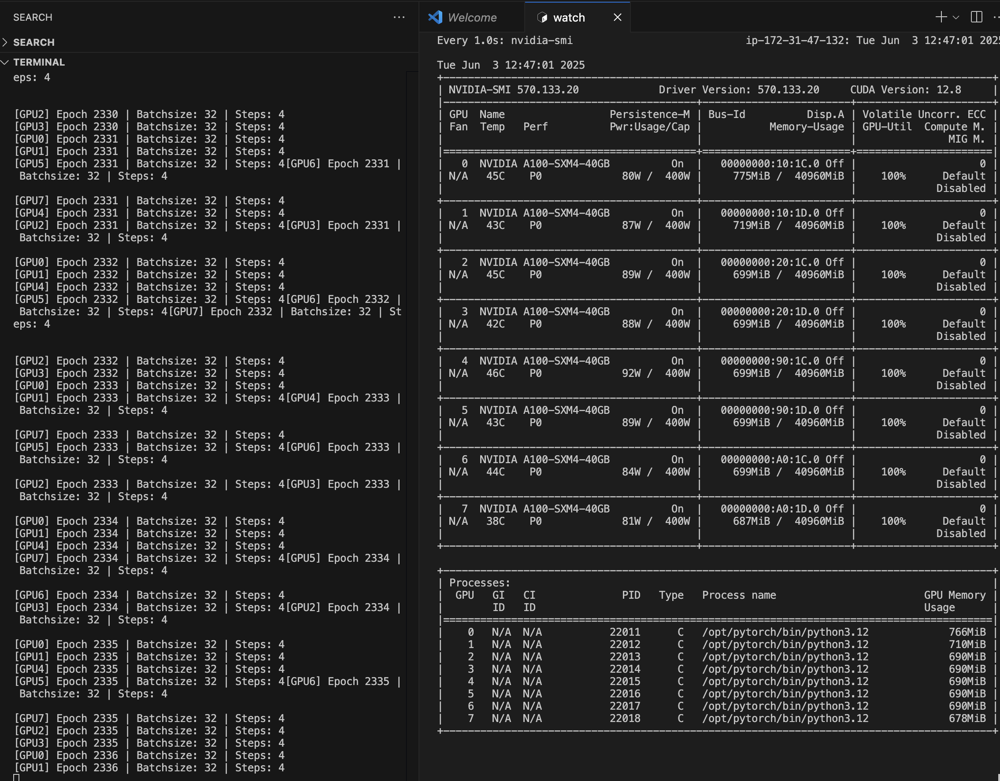
    * The second machine
        * watch -n 1 nvidia-smi
        *  

## 7. 트러블 슈팅:

* 에러: timeout
    - 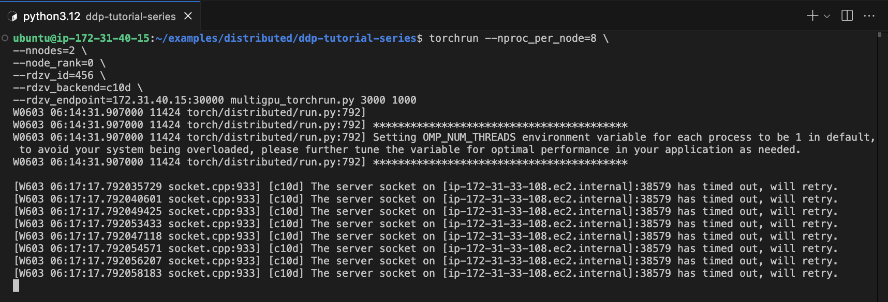
    * 원인
        * 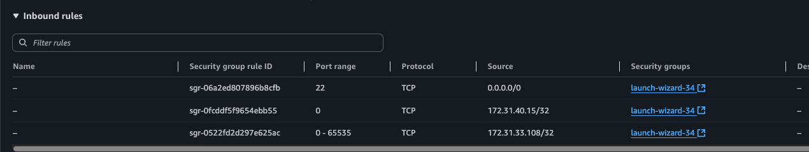
    * 포트가 막혀 있어서, 아래와 같이 수정
        * 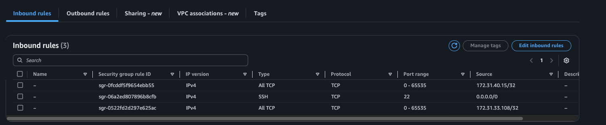
* 에러 : 무응답 
    * 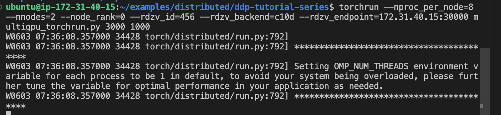
    * 원인
        * 포트 이슈
        * 포트 정리 및 재실행 ( 혹은 포트 번호 바꿈)
            * 30000번 포트 사용 프로세스 확인 
                lsof -i:30000 # 포트 프로세스 종료 
                sudo kill -9 $(lsof -ti:30000)
                
                

